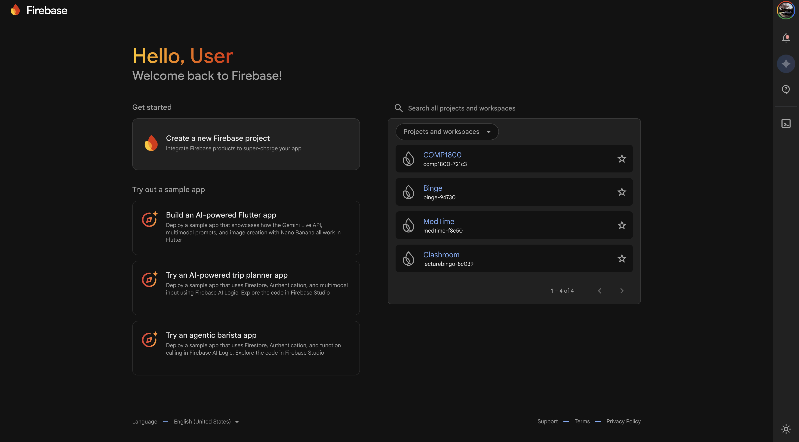
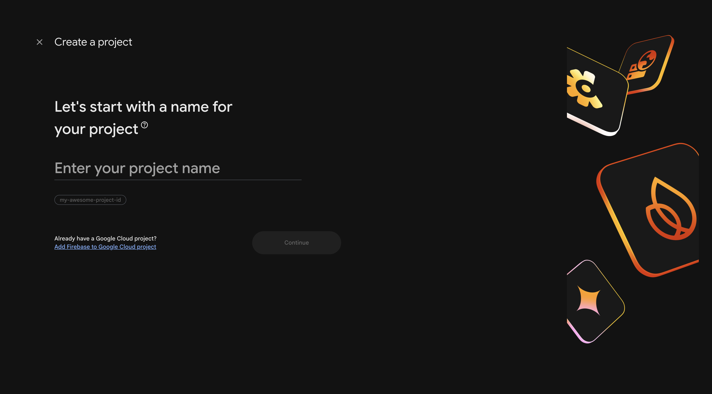
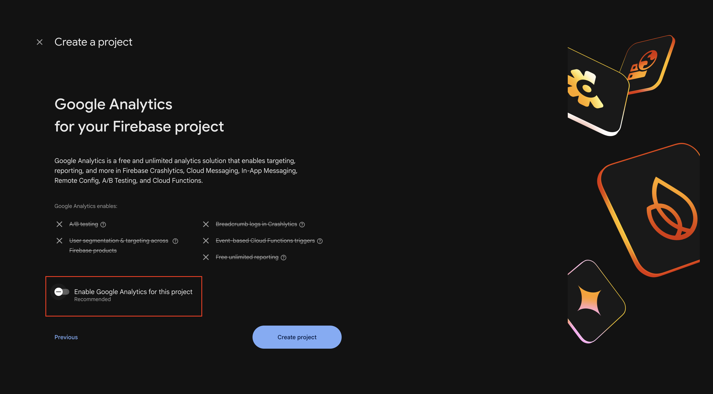
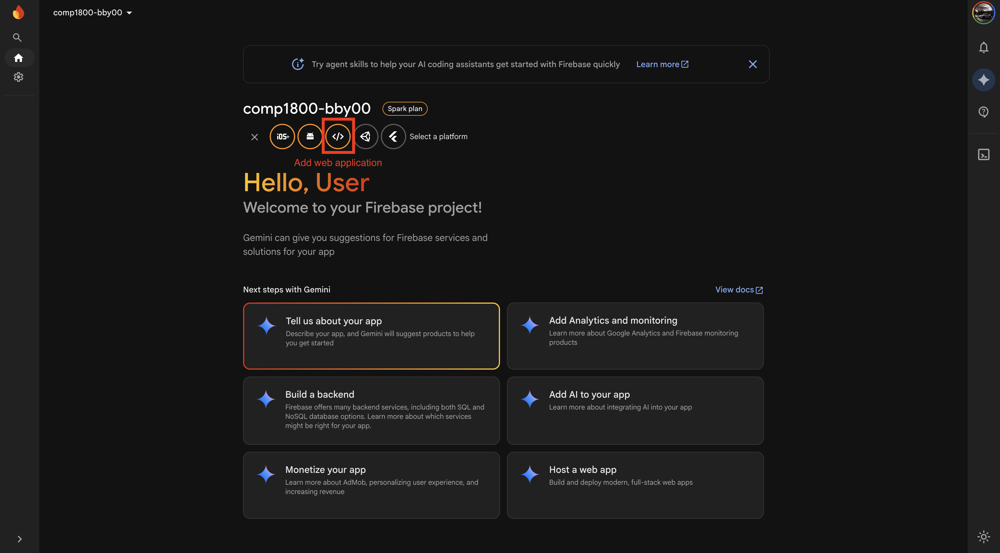
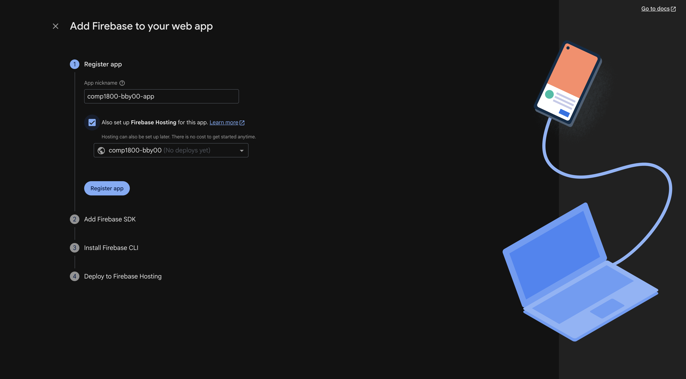
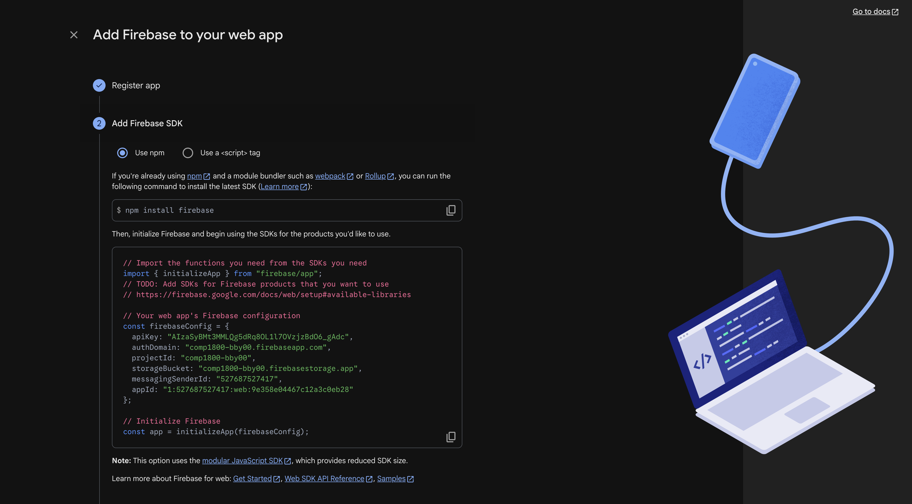
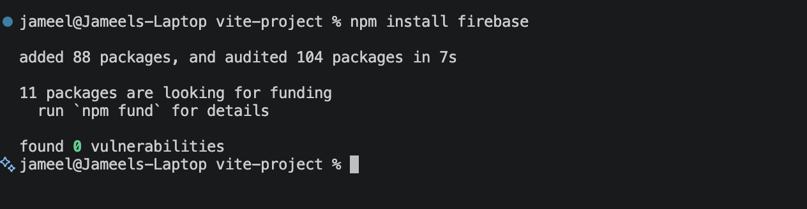

# Setting up Firebase

## Overview

This section walks you through creating a Firebase project, registering your web app, and connecting Firebase to your COMP 1800 project files. By the end of this page, your local project will be linked to Firebase and ready for additional services like Firestore and Authentication.

!!! note
    This process only needs to be done once per project. Once Firebase is connected, all team members can use the same project by sharing the configuration file.

---

## Creating a Firebase Project

A Firebase project is a container that holds all the Firebase services (hosting, database, authentication) for your application. You will create one project for your entire COMP 1800 team.

1. **Open** your browser and **navigate** to the Firebase Console at:

    ```
    https://console.firebase.google.com
    ```

2. **Sign in** with your Google account.

    At this point, the Firebase Console dashboard appears. If this is your first time, the page may be mostly empty.

    <!-- SCREENSHOT: Firebase Console dashboard showing the main page with "Add project" button visible. Crop to show just the center of the page. -->
    
    *Figure 1: The Firebase Console dashboard.*

3. **Click** [Add project].

    The "Create a project" wizard opens with Step 1 of 3.

    <!-- SCREENSHOT: The "Create a project" wizard Step 1, showing the project name input field. -->
    
    *Figure 2: The Create a project wizard - entering a project name.*

4. **Enter** a project name (e.g., `comp1800-bby00` where `00` is your team number).

    !!! note
        Firebase may append a random string of characters to your project name to create a unique project ID (e.g., `comp1800-bby00-a1b2c`). This is normal and expected.

5. **Click** [Continue].

6. On the Google Analytics screen, **toggle off** the "Enable Google Analytics for this project" switch.

    !!! note
        Google Analytics is not required for COMP 1800. Disabling it simplifies the setup. You can always enable it later from your project settings.

    <!-- SCREENSHOT: Google Analytics toggle screen with the switch in the OFF position. -->
    
    *Figure 3: Disabling Google Analytics.*

7. **Click** [Create project].

    Firebase takes a moment to provision your project. A loading animation appears.

8. **Click** [Continue] when the "Your new project is ready" message appears.

    At this point, you are taken to your Firebase project dashboard.

!!! success
    You have successfully created a Firebase project. The project dashboard should now be visible with your project name at the top left.

---

## Registering a Web App

Now that your Firebase project exists, you need to register your COMP 1800 project as a **web app** within Firebase. This generates the configuration keys that connect your code to Firebase services.

1. From the project dashboard, **click** the **web icon** ( `</>` ) in the center of the page under "Get started by adding Firebase to your app."

    <!-- SCREENSHOT: Project dashboard showing the three platform icons (iOS, Android, Web). Circle or highlight the web icon (</>). -->
    
    *Figure 4: Selecting the web platform icon.*

2. **Enter** a nickname for your app (e.g., `comp1800-bby00-app`).

    This nickname is only used within the Firebase Console to identify your app. It is not visible to users.

3. **Check** the box labelled "Also set up Firebase Hosting for this app."

    !!! note
        Checking this box now saves you a step later when you deploy your project in Task 4.

    <!-- SCREENSHOT: The "Add Firebase to your web app" panel showing the nickname field and the Firebase Hosting checkbox checked. -->
    
    *Figure 5: Registering your web app with Firebase Hosting enabled.*

4. **Click** [Register app].

    At this point, Firebase displays a code block titled "Add Firebase SDK." This contains your unique Firebase configuration.

    <!-- SCREENSHOT: The Firebase SDK configuration code block that appears after registering. Make sure the full code snippet is visible. -->
    
    *Figure 6: Your Firebase configuration code block.*

5. **Copy** the entire code block shown on your screen. You will need this in the next section.

    !!! warning
        Do not share your Firebase configuration keys in a public GitHub repository without proper `.gitignore` protection. While these keys are not passwords, exposing them without security rules can allow unauthorized access to your Firebase services.

6. **Click** [Continue to console].

!!! success
    You have registered your web app. Firebase has generated your unique configuration keys.

---

## Adding Firebase to Your Project

With your configuration keys ready, you can now connect Firebase to your actual COMP 1800 project files.

### Adding the Firebase Configuration File

1. **Open** your COMP 1800 project folder in VS Code.

2. **Create** a new file inside your project's `scripts/` folder and **name** it `firebaseAPI_TEAMXX.js`.

    !!! note
        Replace `XX` with your actual team number (e.g., `firebaseAPI_TEAM05.js`). This naming convention is a COMP 1800 requirement.

3. **Paste** the following code into `firebaseAPI_TEAMXX.js`, replacing the placeholder values with the configuration you copied earlier:

    ```javascript
    // Your Firebase configuration
    const firebaseConfig = {
        apiKey: "YOUR_API_KEY",
        authDomain: "YOUR_PROJECT_ID.firebaseapp.com",
        projectId: "YOUR_PROJECT_ID",
        storageBucket: "YOUR_PROJECT_ID.appspot.com",
        messagingSenderId: "YOUR_SENDER_ID",
        appId: "YOUR_APP_ID"
    };

    // Initialize Firebase
    const app = firebase.initializeApp(firebaseConfig);
    ```

    !!! warning
        Make sure you replace every `YOUR_...` placeholder with the actual values from your Firebase configuration. If any value is missing or incorrect, Firebase will not connect.

4. **Save** the file.

### Linking Firebase SDKs in Your HTML

5. **Open** your `index.html` file in VS Code.

6. **Add** the following `<script>` tags inside the `<head>` section of your HTML, **before** any of your own script files:

    ```html
    <!-- Firebase App (the core Firebase SDK) - REQUIRED -->
    <script src="https://www.gstatic.com/firebasejs/8.10.1/firebase-app.js"></script>

    <!-- Firebase Firestore (database) -->
    <script src="https://www.gstatic.com/firebasejs/8.10.1/firebase-firestore.js"></script>

    <!-- Firebase Authentication -->
    <script src="https://www.gstatic.com/firebasejs/8.10.1/firebase-auth.js"></script>
    ```

    !!! note
        The version `8.10.1` is the latest release of the Firebase v8 SDK, which uses simple `<script>` tags. COMP 1800 projects use v8 because it does not require a module bundler. Do not use the v9+ modular SDK unless your instructor specifies otherwise.

7. **Add** a `<script>` tag linking to your Firebase configuration file, **after** the Firebase SDK scripts:

    ```html
    <!-- Your Firebase configuration -->
    <script src="./scripts/firebaseAPI_TEAMXX.js"></script>
    ```

    Your `<head>` section should now look similar to this:

    ```html
    <head>
        <meta charset="UTF-8">
        <meta name="viewport" content="width=device-width, initial-scale=1.0">
        <title>Our COMP 1800 Project</title>

        <!-- Firebase SDKs -->
        <script src="https://www.gstatic.com/firebasejs/8.10.1/firebase-app.js"></script>
        <script src="https://www.gstatic.com/firebasejs/8.10.1/firebase-firestore.js"></script>
        <script src="https://www.gstatic.com/firebasejs/8.10.1/firebase-auth.js"></script>

        <!-- Your Firebase config -->
        <script src="./scripts/firebaseAPI_TEAMXX.js"></script>

        <!-- Your own CSS and JS files below -->
        <link rel="stylesheet" href="./styles/style.css">
    </head>
    ```

8. **Save** `index.html`.

### Verifying the Connection

9. **Open** `index.html` in Google Chrome by double-clicking the file, or by right-clicking and selecting [Open with] → [Google Chrome].

10. **Open** the browser developer console:

    === "Windows"

        **Press** ++f12++ or ++ctrl+shift+j++.

    === "macOS"

        **Press** ++cmd+option+j++.

11. **Type** the following into the console and **press** ++enter++:

    ```javascript
    firebase.app().name
    ```

    At this point, the console should print `"[DEFAULT]"`.

    <!-- SCREENSHOT: Chrome DevTools console showing the output "[DEFAULT]" after typing firebase.app().name. -->
    
    *Figure 7: Successful Firebase connection — the console returns "[DEFAULT]".*

!!! success
    Your Firebase project is now connected to your COMP 1800 project. If the console returned `"[DEFAULT]"`, Firebase is properly initialized. You are now ready to proceed to [Setting Up Firestore](task2_firestore_setup.md).

---

## Conclusion

In this section, you:

- Created a new Firebase project in the Firebase Console
- Registered your COMP 1800 project as a Firebase web app
- Added the Firebase SDK scripts and configuration to your `index.html`
- Verified the connection using the browser console

If the console printed `"[DEFAULT]"` in the verification step, everything is working correctly. If you see errors instead, refer to the [Troubleshooting](troubleshooting.md) page.

**Next:** [Setting Up Cloud Firestore](task2_firestore_setup.md)