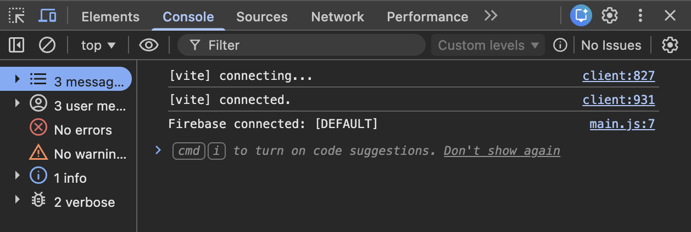

# Setting Up Firebase

## Overview

This section walks you through creating a [Firebase](glossary.md#firebase) project, registering your web app, and connecting Firebase to your COMP 1800 project files. By the end of this page, your local project will be linked to Firebase and ready for additional services like [Cloud Firestore](glossary.md#cloud-firestore) and [Authentication](glossary.md#authentication).

!!! note "One-Time Setup"
    This process only needs to be done once per project. Once Firebase is connected, all team members can use the same project by sharing the configuration file.

---

## Creating a Firebase Project

A Firebase project is a container that holds all the Firebase services (hosting, database, authentication) for your application. You will create one project for your entire COMP 1800 team.

1. **Open** your browser and **navigate** to the Firebase Console at:

    ```
    https://console.firebase.google.com
    ```

2. **Sign in** with your Google account.

    !!! note "First-Time View"
        The Firebase Console dashboard should appear. If this is your first time, the page may be mostly empty.

    <!-- SCREENSHOT: Firebase Console dashboard showing the main page with "Add project" button visible. Crop to show just the center of the page. -->
    
    *Figure 1: The Firebase Console dashboard.*

3. **Click** [Add project].

    The "Create a project" wizard opens with Step 1 of 3.

    <!-- SCREENSHOT: The "Create a project" wizard Step 1, showing the project name input field. -->
    
    *Figure 2: The Create a project wizard - entering a project name.*

4. **Enter** a project name (e.g., `comp1800-bby00` where `00` is your team number).

    !!! note "Project ID Suffix"
        Firebase may append a random string of characters to your project name to create a unique project ID (e.g., `comp1800-bby00-a1b2c`). This is normal and expected.

5. **Click** [Continue].

6. On the Google Analytics screen, **toggle off** the "Enable Google Analytics for this project" switch.

    !!! note "Google Analytics"
        Google Analytics is not required for COMP 1800. Disabling it simplifies the setup. You can always enable it later from your project settings.

    <!-- SCREENSHOT: Google Analytics toggle screen with the switch in the OFF position. -->
    
    *Figure 3: Disabling Google Analytics.*

7. **Click** [Create project].

    Firebase takes a moment to provision your project. A loading animation appears.

8. **Click** [Continue] when the "Your new project is ready" message appears.

    You should now see your Firebase project dashboard.

!!! success "Project Created"
    You have successfully created a Firebase project. The project dashboard should now be visible with your project name at the top left.

---

## Registering a Web App

Now that your Firebase project exists, you need to register your COMP 1800 project as a **web app** within Firebase. This generates the [API key](glossary.md#api-key) and configuration values that connect your code to Firebase services.

1. From the project dashboard, **click** the **web icon** ( `</>` ) in the center of the page under "Get started by adding Firebase to your app."

    <!-- SCREENSHOT: Project dashboard showing the three platform icons (iOS, Android, Web). Circle or highlight the web icon (</>). -->
    
    *Figure 4: Selecting the web platform icon.*

2. **Enter** a nickname for your app (e.g., `comp1800-bby00-app`).

    This nickname is only used within the Firebase Console to identify your app. It is not visible to users.

3. **Check** the box labelled "Also set up Firebase Hosting for this app."

    !!! note "Firebase Hosting"
        Checking this box now saves you a step later when you deploy your project in Task 4. [Firebase Hosting](glossary.md#firebase-hosting) is the service that makes your project accessible as a live website.

    <!-- SCREENSHOT: The "Add Firebase to your web app" panel showing the nickname field and the Firebase Hosting checkbox checked. -->
    
    *Figure 5: Registering your web app with Firebase Hosting enabled.*

4. **Click** [Register app].

    Firebase now displays a code block titled "Add Firebase SDK." This contains your unique Firebase configuration.

    <!-- SCREENSHOT: The Firebase SDK configuration code block that appears after registering. Make sure the full code snippet is visible. -->
    
    *Figure 6: Your Firebase configuration code block.*

5. **Copy** the entire code block shown on your screen. You will need this in the next section.

    !!! warning "API Key Security"
        Do not share your Firebase configuration keys in a public GitHub repository without proper `.gitignore` protection. While these keys are not passwords, exposing them without [security rules](glossary.md#security-rules) can allow unauthorized access to your Firebase services.

6. **Click** [Continue to console].

!!! success "App Registered"
    You have registered your web app. Firebase has generated your unique configuration keys.

---

## Adding Firebase to Your Project

With your configuration keys ready, you can now install the Firebase [SDK](glossary.md#firebase-sdk-software-development-kit) and connect it to your COMP 1800 project. Since your project uses [Vite](glossary.md#vite), you will install Firebase as an npm package and use `import` statements rather than `<script>` tags.

### Installing Firebase via npm

1. **Open** the integrated terminal in VS Code:

    === "Windows"

        **Press** ++ctrl+grave++.

    === "macOS"

        **Press** ++cmd+grave++.

2. **Confirm** your terminal is inside your COMP 1800 project folder. The folder name should appear in the terminal prompt.

    !!! note "Wrong Folder"
        If you are not in the correct folder, **type** `cd` followed by the path to your project folder and **press** ++enter++.

3. **Type** the following command and **press** ++enter++:

    ```bash
    npm install firebase
    ```

    npm downloads the Firebase SDK and adds it to your `node_modules/` folder. You will see a confirmation message when the installation is complete.

    <!-- SCREENSHOT: Terminal showing successful npm install firebase output. -->
    
    *Figure 7: Successful Firebase npm installation.*

### Creating the Firebase Configuration File

4. **Create** a new file at `src/firebaseConfig.js`.

    !!! note "File Location"
        Your COMP 1800 Vite project stores JavaScript source files in the `src/` folder. All Firebase modules will import from this single configuration file.

5. **Paste** the following code into `src/firebaseConfig.js`, replacing the placeholder values with the configuration you copied earlier:

    ```javascript
    // src/firebaseConfig.js
    import { initializeApp } from "firebase/app";
    import { getFirestore } from "firebase/firestore";
    import { getAuth } from "firebase/auth";

    const firebaseConfig = {
        apiKey: "YOUR_API_KEY",
        authDomain: "YOUR_PROJECT_ID.firebaseapp.com",
        projectId: "YOUR_PROJECT_ID",
        storageBucket: "YOUR_PROJECT_ID.appspot.com",
        messagingSenderId: "YOUR_SENDER_ID",
        appId: "YOUR_APP_ID"
    };

    const app = initializeApp(firebaseConfig);

    export const db   = getFirestore(app);
    export const auth = getAuth(app);
    ```

    This file initializes Firebase once and exports the `db` ([Firestore](glossary.md#cloud-firestore)) and `auth` ([Authentication](glossary.md#authentication)) instances. Every other file in your project will import from here rather than calling `initializeApp` again.

    !!! warning "Replace Placeholders"
        Make sure you replace every `YOUR_...` placeholder with the actual values from your Firebase configuration. If any value is missing or incorrect, Firebase will not connect. You can find your values again in the [Firebase Console](glossary.md#firebase-console) under [Project Settings] → [Your apps] → [SDK setup and configuration]. See [Troubleshooting](troubleshooting.md) if you encounter errors.

6. **Save** `src/firebaseConfig.js`.

### Verifying the Connection

7. **Open** your `src/main.js` file (or whichever script is loaded by your `index.html`).

8. **Add** the following temporary import at the top of the file:

    ```javascript
    import { db } from "./firebaseConfig.js";
    console.log("Firebase connected:", db.app.name);
    ```

9. **Save** the file.

10. **Start** the Vite development server by running the following in your terminal:

    ```bash
    npm run dev
    ```

    [Vite](glossary.md#vite) should print a local URL such as `http://localhost:5173`.

11. **Open** the URL in Google Chrome.

12. **Open** the browser [developer console](glossary.md#console-browser):

    === "Windows"

        **Press** ++f12++ or ++ctrl+shift+j++.

    === "macOS"

        **Press** ++cmd+option+j++.

    The console should print `Firebase connected: [DEFAULT]`. This confirms Firebase has been initialized successfully.

    <!-- SCREENSHOT: Chrome DevTools console showing "Firebase connected: [DEFAULT]". -->
    
    *Figure 8: Successful Firebase connection — the console prints "[DEFAULT]".*

13. **Remove** the two temporary lines you added to `src/main.js` (the `import` and `console.log`).

14. **Save** the file.

!!! success "Firebase Connected"
    Your Firebase project is now connected to your COMP 1800 project. If the console printed `Firebase connected: [DEFAULT]`, Firebase is properly initialized. You are now ready to proceed to [Setting Up Firestore](task2_firestore_setup.md).

---

## Conclusion

In this section, you:

- Created a new Firebase project in the [Firebase Console](glossary.md#firebase-console)
- Registered your COMP 1800 project as a Firebase web app
- Installed the Firebase [SDK](glossary.md#firebase-sdk-software-development-kit) via npm and created `src/firebaseConfig.js`
- Verified the connection using [Vite](glossary.md#vite) and the browser [developer console](glossary.md#console-browser)

If the console printed `Firebase connected: [DEFAULT]` in the verification step, everything is working correctly. If you see errors instead, refer to the [Troubleshooting](troubleshooting.md) page.

**Next:** [Setting Up Cloud Firestore](task2_firestore_setup.md)