# Setting Up Cloud Firestore Database

## Overview

This section walks you through creating a [Cloud Firestore](glossary.md#cloud-firestore) database, understanding how Firestore organizes data, adding data manually through the [Firebase Console](glossary.md#firebase-console), and reading and writing data from your COMP 1800 project using JavaScript.

By the end of this page, your project will be able to store and retrieve data from a cloud database.

!!! note
    Make sure you have completed [Task 1: Setting Up Firebase](task1_firebase_setup.md) before starting this section. Your project must already be connected to Firebase.

---

## Creating a Firestore Database

Cloud Firestore is Firebase's flexible, scalable database. You will use it to store data such as user profiles, app content, and settings for your COMP 1800 project.

1. **Open** the [Firebase Console](https://console.firebase.google.com) and **click** on your project name to open it.

2. **Click** [Databases & Storage] in the left sidebar menu.

    A submenu expands below the Build heading.

    <!-- SCREENSHOT: Left sidebar with [Databases and Storage] expanded showing submenu items including Firestore. Highlight the sidebar area. -->
    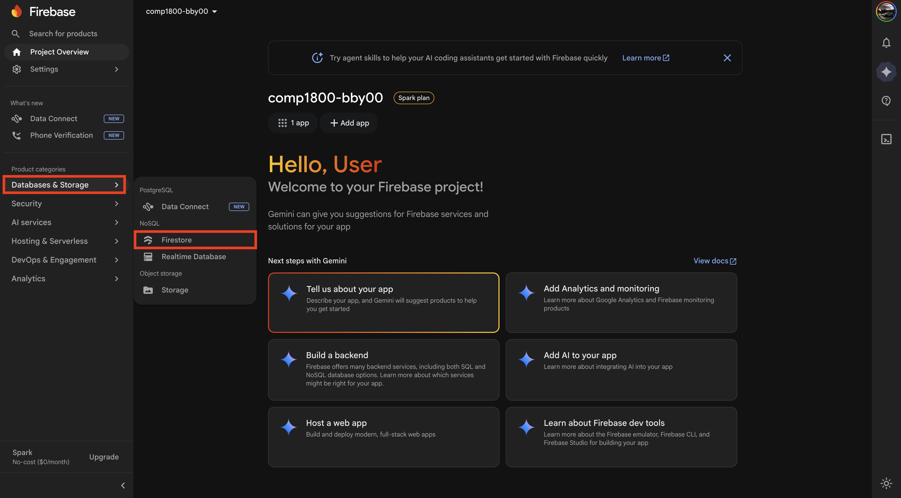
    *Figure 1: The Databases & Storage submenu in the left sidebar.*

3. **Click** [Firestore].

    The Firestore landing page appears with a "Create database" button.

    <!-- SCREENSHOT: Firestore landing page showing the "Create database" button in the center. -->
    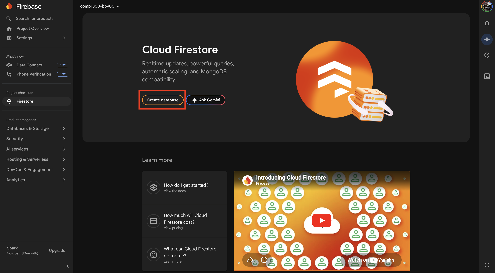
    *Figure 2: The Firestore Database landing page.*

4. **Click** [Create database].

    A setup wizard opens.

5. **Select** Standard Edition.

6. **Click** [Next].

7. **Select** a Firestore location from the dropdown menu. **Choose** `northamerica-northeast1 (Montréal)` as it is the closest region to Vancouver.

    !!! danger
        The database location **cannot be changed** after creation. Make sure you select the correct region before proceeding. Choosing a distant region will increase data retrieval times for your users.

    <!-- SCREENSHOT: Location dropdown with "us-west1 (Oregon)" selected or highlighted. -->
    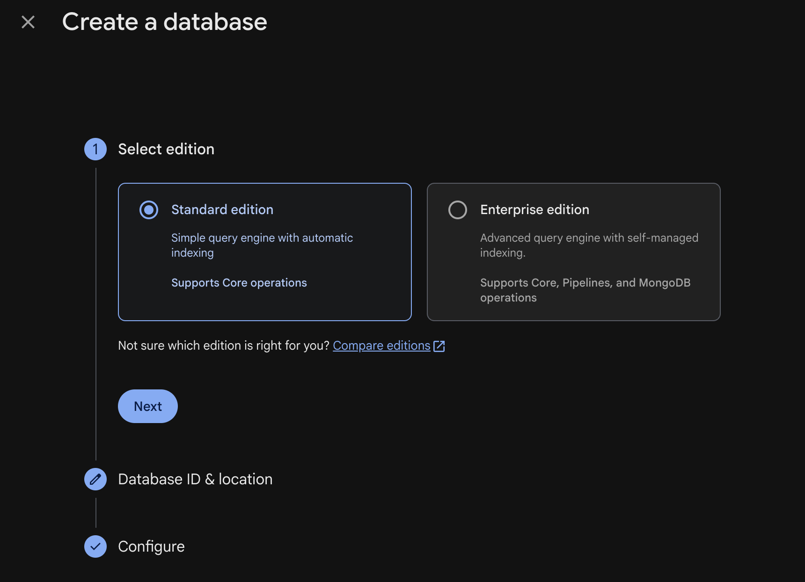
    *Figure 3: Selecting the Oregon database location.*

8. **Click** [Next].

9. **Select** "Start in [test mode](glossary.md#test-mode)."

    [Test mode](glossary.md#test-mode) allows open read and write access for 30 days, which is suitable for development.

    !!! warning
        Test mode [security rules](glossary.md#security-rules) expire after 30 days. If your database reads and writes suddenly stop working later in the term, check whether your security rules have expired. See [Troubleshooting](troubleshooting.md#firestore-reads-and-writes-suddenly-stopped-working) for the fix.

    !!! note
        The Firebase Console will display the exact expiry date for your test mode rules. Take note of this date.

    <!-- SCREENSHOT: Security rules screen with "Start in test mode" radio button selected, showing the expiry date text. -->
    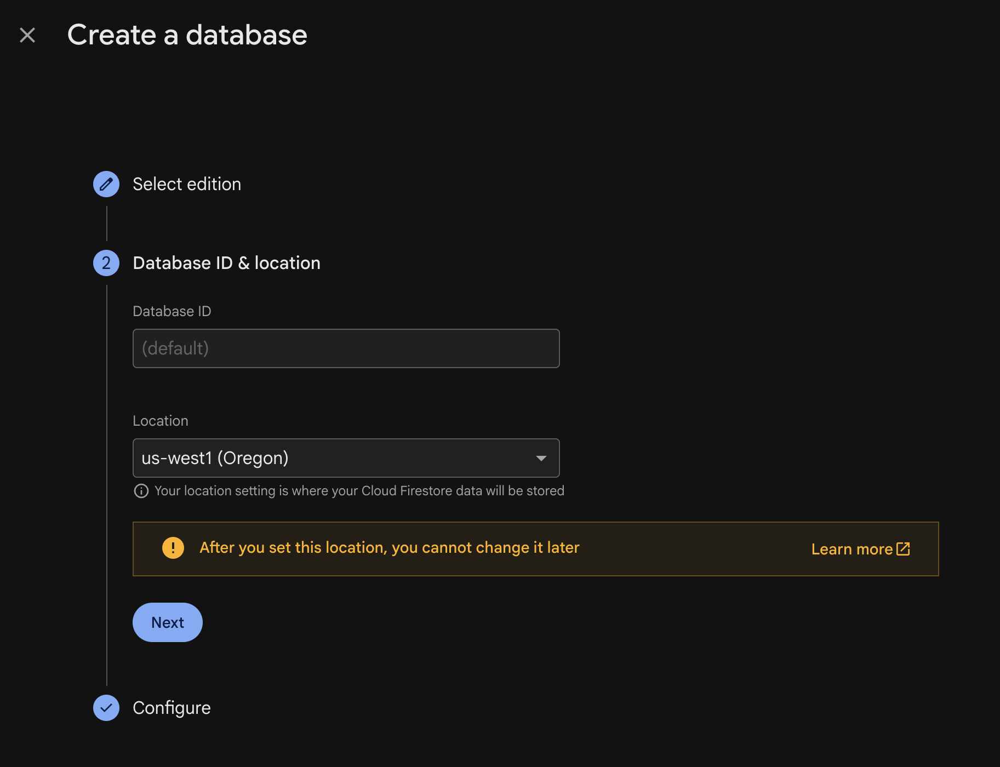
    *Figure 4: Selecting test mode for security rules.*

10. **Click** [Create].

    Firestore takes a few seconds to provision your database. Once complete, the Firestore data viewer appears. It will be empty.

    <!-- SCREENSHOT: Empty Firestore data viewer showing the "Start collection" prompt in the center. -->
    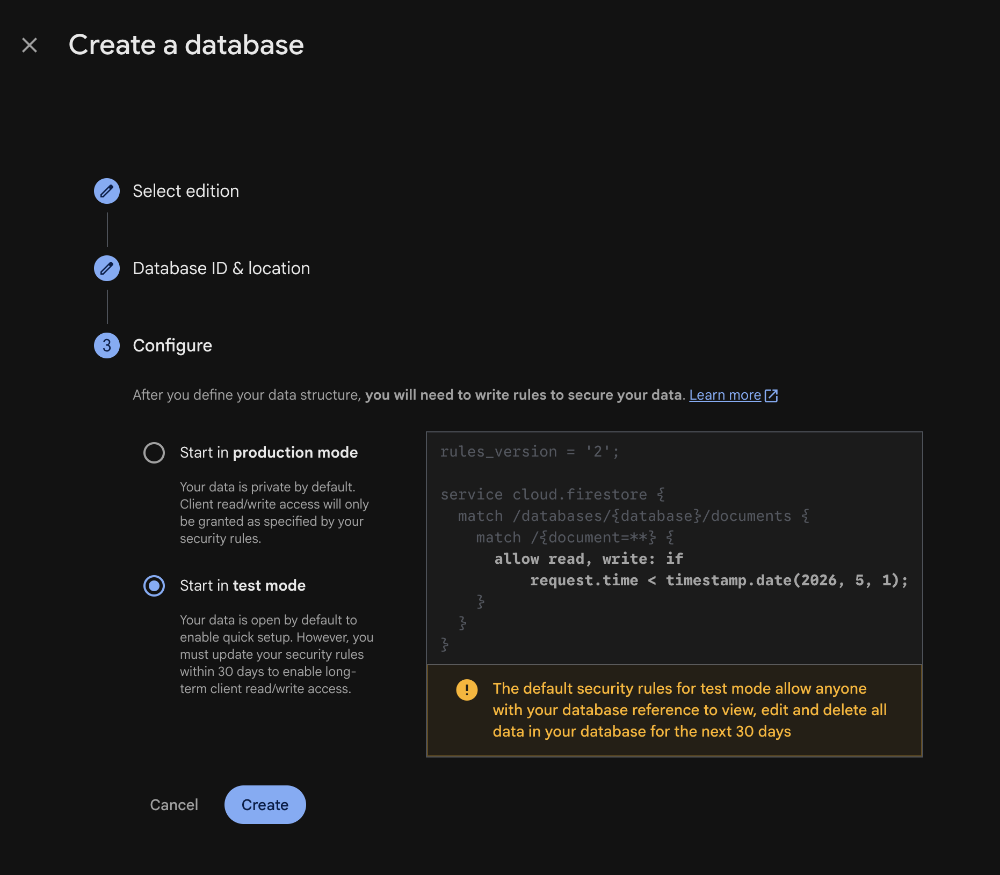
    *Figure 5: The empty Firestore data viewer, ready for data.*

!!! success
    You have created a Cloud Firestore database. The data viewer is now visible and ready for you to add [collections](glossary.md#collection) and [documents](glossary.md#document).

---

## Understanding Firestore Structure

Before adding data, it is important to understand how Firestore organizes information. Firestore does not use traditional tables and rows like SQL databases. Instead, it uses **[collections](glossary.md#collection)** and **[documents](glossary.md#document)**.

- A **collection** is a group of documents, similar to a folder. For example, a collection called `users` would hold all user-related documents.
- A **document** is a single record within a collection, similar to a file inside a folder. Each document contains **[fields](glossary.md#field)** with values. For example, a document inside `users` might have fields like `name`, `email`, and `city`.
- Each document is identified by a unique **[document ID](glossary.md#document-id)**, which can be auto-generated or manually set.

Here is a visual example of how COMP 1800 project data might be organized:

```
users (collection)
├── user001 (document)
│   ├── name: "Alice"
│   ├── email: "alice@bcit.ca"
│   └── city: "Vancouver"
├── user002 (document)
│   ├── name: "Bob"
│   ├── email: "bob@bcit.ca"
│   └── city: "Burnaby"
```

!!! note
    Think of collections as tables and documents as rows if you are familiar with databases. The key difference is that each document can have different fields — they do not all need to follow the same structure.

---

## Adding Data Manually via the Firebase Console

Before writing JavaScript code, you will add a test document using the Firebase Console to confirm your database is working.

1. From the Firestore data viewer, **click** [Start collection].

    <!-- SCREENSHOT: Firestore viewer with the "Start collection" link/button highlighted. -->
    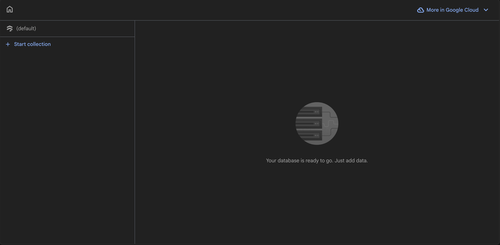
    *Figure 6: The Start collection button.*

2. **Enter** `users` as the Collection ID.

    <!-- SCREENSHOT: The "Start a collection" dialog with "users" typed in the Collection ID field. -->
    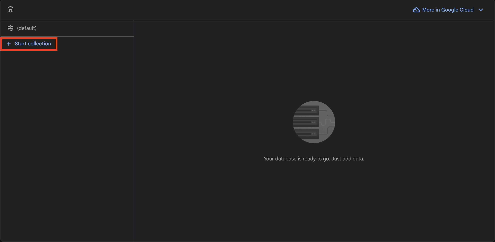
    *Figure 7: Entering the collection name.*

3. **Click** [Next].

    The "Add a document" panel appears.

4. **Click** [Auto-ID] to let Firebase generate a unique [document ID](glossary.md#document-id) automatically.

    !!! note
        Auto-generated IDs look like a random string of characters (e.g., `aB3dEf7gHi`). This is normal. You can also enter a custom ID if you prefer, but Auto-ID is recommended for most cases.

5. **Enter** the first field:
    - Field name: `name`
    - Type: **select** `string` from the dropdown
    - Value: `Test User`

6. **Click** the **+** (add field) button to add another field:
    - Field name: `email`
    - Type: **select** `string`
    - Value: `testuser@bcit.ca`

7. **Click** the **+** (add field) button one more time to add a third field:
    - Field name: `city`
    - Type: **select** `string`
    - Value: `Vancouver`

    <!-- SCREENSHOT: The "Add a document" panel showing all three fields filled in (name, email, city) with the Auto-ID generated. -->
    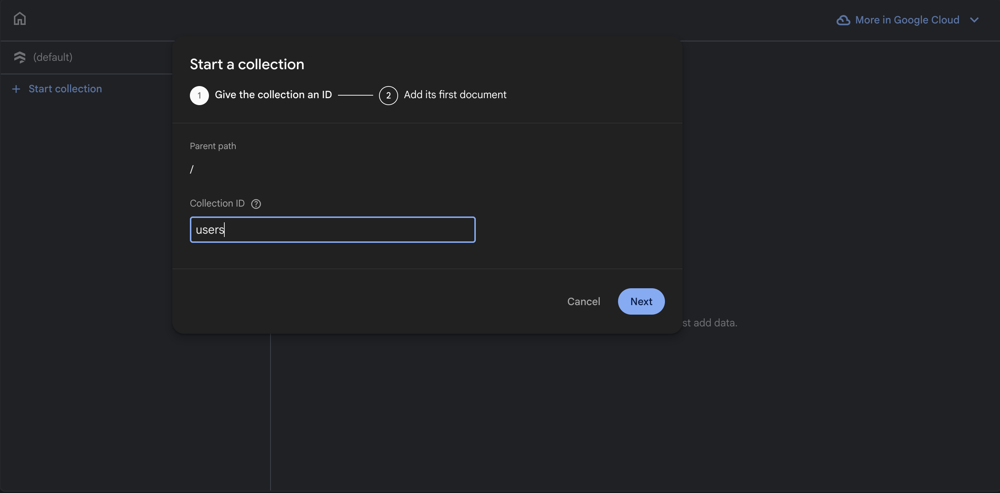
    *Figure 8: A completed document ready to save.*

8. **Click** [Save].

    The document now appears in the Firestore data viewer under the `users` collection.

    <!-- SCREENSHOT: Firestore data viewer showing the "users" collection with the newly created document and its fields visible. -->
    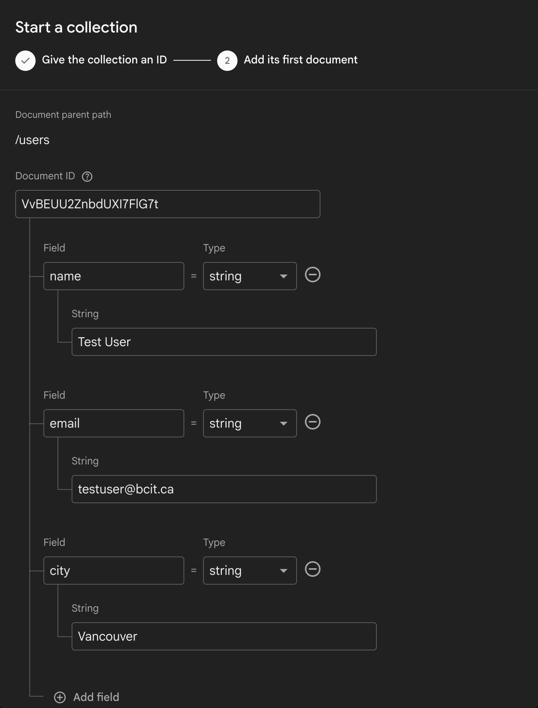
    *Figure 9: The saved document visible in the Firestore data viewer.*

!!! success
    You have manually added a document to Firestore. The `users` collection now contains one document with `name`, `email`, and `city` fields.

---

## Reading Firestore Data from Your Project

Now that there is data in your Firestore database, you will write JavaScript to retrieve and display it in the browser [console](glossary.md#console-browser).

1. **Open** your COMP 1800 project in VS Code.

2. **Create** a new file at `src/firestoreTest.js`.

3. **Add** the following code to `src/firestoreTest.js`:

    ```javascript
    // src/firestoreTest.js
    import { collection, getDocs } from "firebase/firestore";
    import { db } from "./firebaseConfig.js";

    // Read all documents from the "users" collection
    async function readUsers() {
        const querySnapshot = await getDocs(collection(db, "users"));
        querySnapshot.forEach((doc) => {
            console.log(doc.id, " => ", doc.data());
        });
    }

    readUsers();
    ```

    This code imports the Firestore functions from the Firebase v9 SDK, connects to your database via the `db` instance from `firebaseConfig.js`, and prints each document's ID and data to the browser console.

4. **Open** `src/main.js` in VS Code.

5. **Add** the following import at the top of the file:

    ```javascript
    import "./firestoreTest.js";
    ```

    !!! warning
        The `firestoreTest.js` import must appear **after** any imports from `firebaseConfig.js`. If `firebaseConfig.js` has not been loaded yet, you will see an initialization error. See [Troubleshooting](troubleshooting.md#firebase-initialization-errors-in-vite) for help resolving this.

6. **Save** both files.

7. **Start** the Vite development server (if not already running):

    ```bash
    npm run dev
    ```

8. **Open** the URL printed by Vite (e.g., `http://localhost:5173`) in Google Chrome.

9. **Open** the browser [developer console](glossary.md#console-browser):

    === "Windows"

        **Press** ++f12++ or ++ctrl+shift+j++.

    === "macOS"

        **Press** ++cmd+option+j++.

    At this point, the console should display the document ID and data you added earlier. The output will look similar to:

    ```
    aB3dEf7gHi  =>  {name: "Test User", email: "testuser@bcit.ca", city: "Vancouver"}
    ```

    <!-- SCREENSHOT: Chrome DevTools console showing the Firestore read output with the document ID and fields printed. -->
    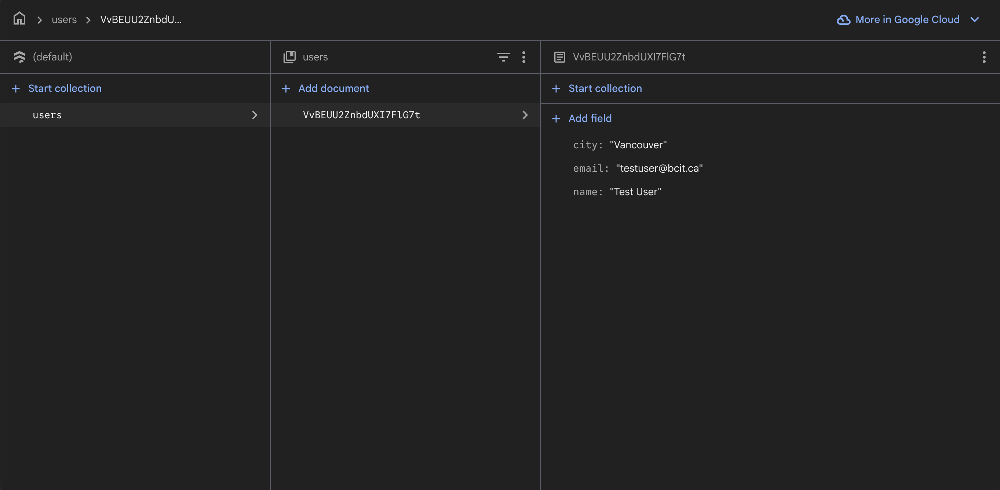
    *Figure 10: Firestore data successfully read and displayed in the console.*

!!! success
    Your project can now read data from Firestore. If you see your document data printed in the console, the connection is working correctly. If nothing appears, see [Troubleshooting](troubleshooting.md#console-shows-no-output-when-reading-from-firestore).

---

## Writing Data to Firestore from Your Project

Next, you will add JavaScript code that writes a new document to Firestore directly from your project.

1. **Open** `src/firestoreTest.js` in VS Code.

2. **Replace** the entire contents with the following code, which includes both reading and writing:

    ```javascript
    // src/firestoreTest.js
    import { collection, getDocs, addDoc } from "firebase/firestore";
    import { db } from "./firebaseConfig.js";

    // Read all documents from the "users" collection
    async function readUsers() {
        const querySnapshot = await getDocs(collection(db, "users"));
        querySnapshot.forEach((doc) => {
            console.log(doc.id, " => ", doc.data());
        });
    }

    // Write a new document to the "users" collection
    async function addUser() {
        try {
            const docRef = await addDoc(collection(db, "users"), {
                name: "Jane Doe",
                email: "janedoe@bcit.ca",
                city: "Surrey"
            });
            console.log("Document written with ID: ", docRef.id);
        } catch (error) {
            console.error("Error adding document: ", error);
        }
    }

    readUsers();
    addUser();
    ```

    This code uses the v9 modular function `addDoc` to create a new [document](glossary.md#document) in the `users` [collection](glossary.md#collection) with three [fields](glossary.md#field): `name`, `email`, and `city`. Firebase automatically generates a unique [document ID](glossary.md#document-id).

3. **Save** the file.

4. **Refresh** the browser tab running your Vite dev server.

5. **Open** the browser [developer console](glossary.md#console-browser) (if not already open):

    === "Windows"

        **Press** ++f12++ or ++ctrl+shift+j++.

    === "macOS"

        **Press** ++cmd+option+j++.

    The console should display a message similar to:

    ```
    Document written with ID: xY9zAb2CdE
    ```

    <!-- SCREENSHOT: Chrome DevTools console showing the "Document written with ID: ..." success message. -->
    
    *Figure 11: Confirmation that a new document was written to Firestore.*

6. **Return** to the Firebase Console in your browser.

7. **Navigate** to [Firestore Database] and **click** on the `users` collection.

8. **Verify** that the new document appears in the data viewer with the fields `name: "Jane Doe"`, `email: "janedoe@bcit.ca"`, and `city: "Surrey"`.

    <!-- SCREENSHOT: Firestore data viewer showing two documents in the "users" collection — the original test document and the newly written "Jane Doe" document. -->
    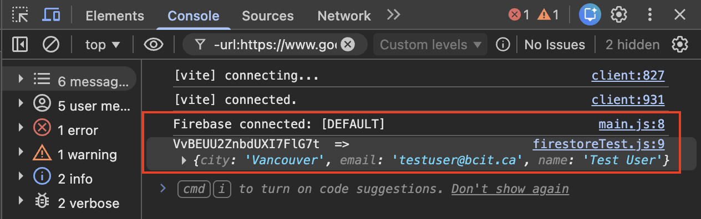
    *Figure 12: The users collection now contains two documents.*

!!! success
    Your project can now both read from and write to Firestore. You have a fully functional database connection.

---

## Cleaning Up Test Code

Before continuing to the next task, remove the test code so it does not run every time your page loads.

1. **Open** `src/main.js` in VS Code.

2. **Remove** the line `import "./firestoreTest.js";`.

3. **Delete** the file `src/firestoreTest.js` from your project.

4. **Save** all modified files.

!!! note
    The test documents you added (both through the console and through JavaScript) will remain in your Firestore database. You can delete them manually from the [Firestore data viewer](glossary.md#firestore-data-viewer) by clicking the three-dot menu next to each document and selecting [Delete document].

---

## Conclusion

In this section, you:

- Created a [Cloud Firestore](glossary.md#cloud-firestore) database in the [Firebase Console](glossary.md#firebase-console)
- Learned how Firestore organizes data using [collections](glossary.md#collection) and [documents](glossary.md#document)
- Added a test document manually through the Firebase Console
- Read Firestore data from your project using JavaScript and displayed it in the browser [console](glossary.md#console-browser)
- Wrote a new document to Firestore from your project using JavaScript
- Cleaned up test code

If both the read and write operations displayed the expected output in the browser console, your Firestore database is correctly configured. If you encountered errors, refer to the [Troubleshooting](troubleshooting.md) page.

**Next:** [Setting Up Firebase Authentication](task3_authentication.md)