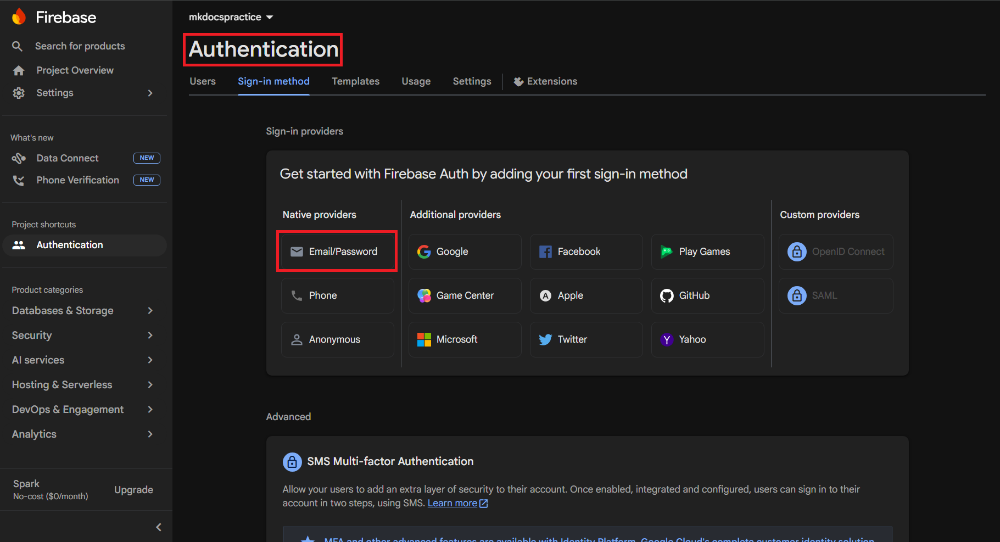
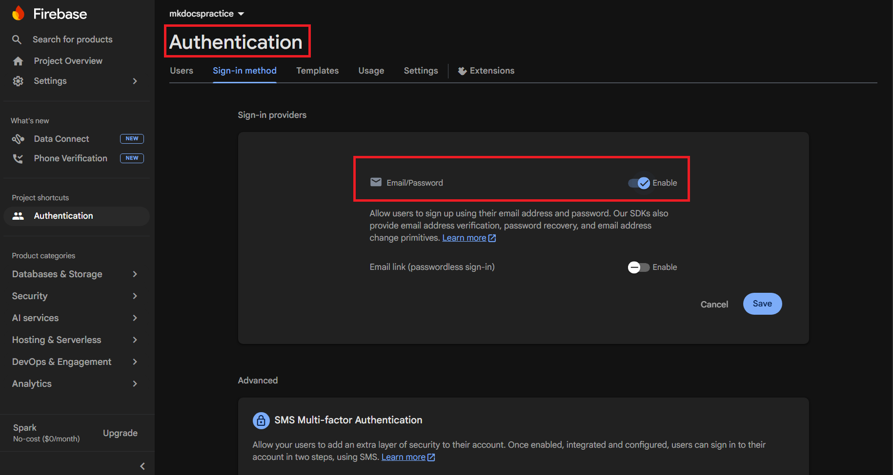
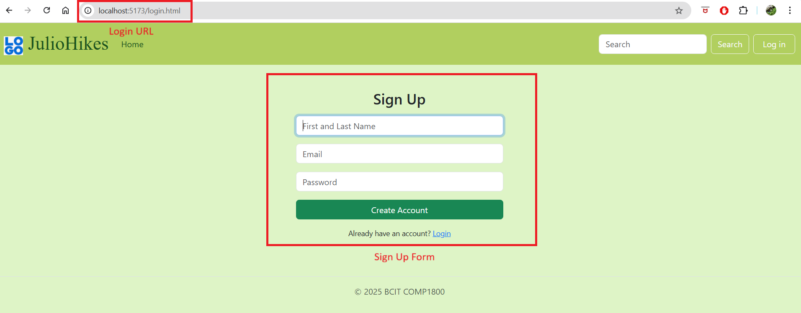
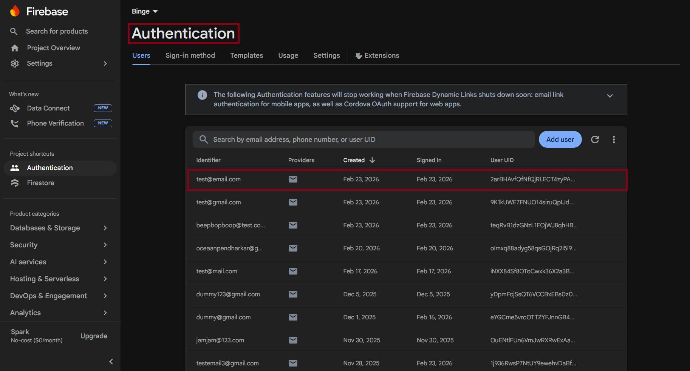

# Setting Up Firebase Authentication

## Overview

This section walks you through enabling Firebase [Authentication](glossary.md#authentication) in the [Firebase Console](glossary.md#firebase-console), creating the `src/firebaseConfig.js`, `src/authentication.js`, and `src/login.js` module files, and building a single `login.html` page with toggling login and sign-up views.

The goal of this page is to allow users to create accounts with a username and email address, sign in with email and password, and be redirected to the `login.html` page when they visit a protected page without being signed in.

!!! note
    Make sure you have completed [Task 1: Setting Up Firebase](task1_firebase_setup.md) 
    and [Task 2: Setting Up Cloud Firestore Database](task2_firestore_setup.md) 
    before starting this section. Your project must already have Firebase installed 
    as a Node package and have a working `src/firebaseConfig.js` skeleton.

!!! note
    Your COMP 1800 project uses the **Firebase v9 modular SDK** bundled through [Vite](glossary.md#vite). All Firebase functions are imported using ES module `import` statements rather than loaded via `<script>` tags.
---

## Enabling Email/Password Authentication

Before writing any code, you must enable the Email/Password sign-in method inside the Firebase Console.

1. **Open** the [Firebase Console](https://console.firebase.google.com) and **click** on your project.

2. **Click** [Search] in the left sidebar, then search for [Authentication].
 
3. **Click** [Get started].
 
4. **Click** the [Sign-in method] tab.
 
5. **Click** [Email/Password] under the "Native providers" section.
 
    
    *Figure 1: The Email/Password provider in the Sign-in method tab.*

6. **Toggle** on the first switch labelled "Email/Password".
 
    !!! note
        Do **not** enable the second toggle labelled "Email link (passwordless sign-in)." Your COMP 1800 project will use standard password-based login only.
 
    
    *Figure 2: Enabling the Email/Password sign-in method.*
 
7. **Click** [Save].
 
    "Email/Password" should appear as an **Enabled** provider in the list.
 
!!! success
    Email/Password authentication is now enabled for your Firebase project.
 
---

## Configuring src/firebaseConfig.js
 
Your COMP 1800 project initialises Firebase once in `src/firebaseConfig.js` and exports the `auth` and `db` instances. Every other module imports from this file rather than calling `initializeApp` again.
 
1. **Open** `src/firebaseConfig.js` in VS Code.
 
2. **Replace** its contents with the following, pasting your own project values in place of the placeholders:
 
    ```javascript
    // src/firebaseConfig.js
    import { initializeApp } from "firebase/app";
    import { getFirestore } from "firebase/firestore";
    import { getAuth } from "firebase/auth";
 
    const firebaseConfig = {
        apiKey: "YOUR_API_KEY",
        authDomain: "YOUR_PROJECT_ID.firebaseapp.com",
        projectId: "YOUR_PROJECT_ID",
        storageBucket: "YOUR_PROJECT_ID.appspot.com",
        messagingSenderId: "YOUR_SENDER_ID",
        appId: "YOUR_APP_ID"
    };
 
    const app = initializeApp(firebaseConfig);
 
    export const db   = getFirestore(app);
    export const auth = getAuth(app);
    ```
 
    !!! warning
        Replace every `YOUR_...` placeholder with the actual values from your Firebase project. Find these in the Firebase Console under [Project Settings] → [Your apps] → [SDK setup and configuration].
 
3. **Save** `src/firebaseConfig.js`.
 
---

## Creating src/authentication.js
 
`src/authentication.js` exports a single reusable function, `requireLogin()`, that any page can call to redirect unauthenticated visitors to `login.html`.
 
1. **Create** the file `src/authentication.js`.
 
2. **Add** the following code to the `src/authentication.js` file and save the file:

    ```javascript
    // src/authentication.js
    import { onAuthStateChanged } from "firebase/auth";
    import { auth } from "./firebaseConfig.js";

    /**
     * Redirects the user to login.html if they are not signed in.
     * Import and call this at the top of any protected page script.
     */
    export function requireLogin() {
        onAuthStateChanged(auth, (user) => {
            if (!user) {
                window.location.href = "/login.html";
            }
        });
    }
    ```

3. To protect any page, import and call `requireLogin()` at the top of that page's script. For example, in `src/main.js`:

    ```javascript
    import { requireLogin } from "./authentication.js";
    requireLogin();
    ```

!!! note
    Do **not** add `requireLogin()` to the script loaded by `login.html` itself.
 
---

## Creating src/login.js
 
`src/login.js` handles both the sign-up and login form submissions and controls which form is visible on `login.html`.
 
1. **Create** the file `src/login.js`.
 
2. **Add** the following code:
 
    ```javascript
    // src/login.js
    import {
        createUserWithEmailAndPassword,
        signInWithEmailAndPassword
    } from "firebase/auth";
    import { doc, setDoc } from "firebase/firestore";
    import { auth, db } from "./firebaseConfig.js";
 
    // --- Toggle between login and sign-up views ---
    const loginView  = document.getElementById("loginView");
    const signupView = document.getElementById("signupView");
 
    document.getElementById("toSignup").addEventListener("click", (e) => {
        e.preventDefault();
        loginView.classList.add("d-none");
        signupView.classList.remove("d-none");
    });
 
    document.getElementById("toLogin").addEventListener("click", (e) => {
        e.preventDefault();
        signupView.classList.add("d-none");
        loginView.classList.remove("d-none");
    });
 
    // --- Sign-up form ---
    document.getElementById("signupForm").addEventListener("submit", async (e) => {
        e.preventDefault();
 
        const username = document.getElementById("signupName").value.trim();
        const email    = document.getElementById("signupEmail").value.trim();
        const password = document.getElementById("signupPassword").value;
        const confirm  = document.getElementById("signupConfirmPassword").value;
 
        if (password !== confirm) {
            alert("Passwords do not match.");
            return;
        }
 
        try {
            const credential = await createUserWithEmailAndPassword(auth, email, password);
 
            // Store the username in the Firestore users collection
            await setDoc(doc(db, "users", credential.user.uid), {
                username: username,
                email: email
            });
 
            window.location.href = "/index.html";
        } catch (error) {
            alert(error.message);
        }
    });
 
    // --- Login form ---
    document.getElementById("loginForm").addEventListener("submit", async (e) => {
        e.preventDefault();
 
        const email    = document.getElementById("loginEmail").value.trim();
        const password = document.getElementById("loginPassword").value;
 
        try {
            await signInWithEmailAndPassword(auth, email, password);
            window.location.href = "/index.html";
        } catch (error) {
            alert(error.message);
        }
    });
    ```
 
3. **Save** `src/login.js`.
 
---

## Adding Sign-Out to a Page
 
To let users sign out, add a button and import the Firebase `signOut` function into that page's script.
 
1. **Add** a sign-out button to the chosen HTML page:
 
    ```html
    <button id="signoutBtn">Sign Out</button>
    ```
 
2. **Open** that page's script file and **add** the following:
 
    ```javascript
    import { signOut } from "firebase/auth";
    import { auth } from "./firebaseConfig.js";
 
    document.getElementById("signoutBtn").addEventListener("click", () => {
        signOut(auth)
            .then(() => { window.location.href = "/login.html"; })
            .catch((error) => { console.error("Sign-out error:", error); });
    });
    ```
 
3. **Save** the file.
 
---

## Verifying the authentication is working
 
1. **Run** the Vite development in the command line:
 
    ```
    npm run dev
    ```
 
   Vite should print a local URL such as `http://localhost:5173`.
 
2. **Open** `http://localhost:5173/login.html` in Google Chrome.
 
3. **Click** the [Sign up] link.
 
    The login form hides and the sign-up form appears.
 
    
    *Figure 3: The sign-up view of login.html.*
 
4. **Enter** a username, a valid email address, and a password of at least six characters, then **click** [Sign Up!].
 
    The browser should redirect to `index.html`.
 
5. **Open** the Firebase Console, **navigate** to [Authentication] → [Users], and **confirm** your new test user appears in the list.
 
    
    *Figure 4: The new user visible in the Firebase Console.*
 
6. **Click** [Sign Out], **return** to `login.html`, **enter** your email and password, and **click** [Login].
 
    Once the user is logged in, the browser should redirect back to `index.html`.
 
!!! success
    Firebase authentication is now working correctly. Users can create accounts, sign in, and sign out.

---
 
## Conclusion
 
In this section, you:
 
- Enabled Email/Password authentication in the Firebase Console
- Updated `src/firebaseConfig.js` to export `auth` and `db`
- Created `src/authentication.js` with a reusable `requireLogin()` function
- Created `src/login.js` to handle sign-up and login form submissions
- Built a single `login.html` containing both the login and sign-up forms
 
If users can sign up, appear in the Firebase Console Users list, log in, and sign out, your setup is complete. If you encounter errors, refer to the [Troubleshooting](troubleshooting.md) page.
 
**Next:** [Deploying Your Project](task4_deploy.md)