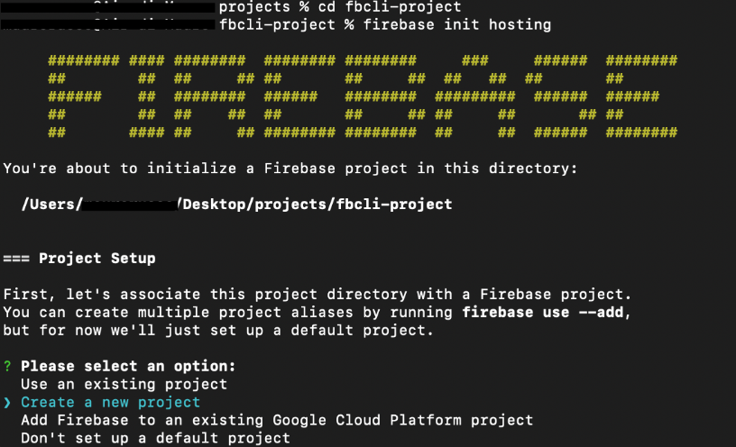
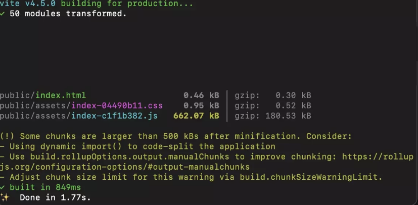
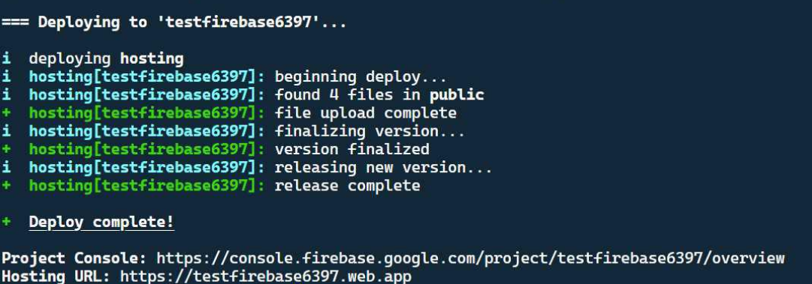

# Deploying Your Project to Firebase Hosting
 
## Overview
 
This section walks you through installing the Firebase CLI, logging in, building your project with [Vite](glossary.md#vite), and deploying to [Firebase Hosting](glossary.md#firebase-hosting) as a live website.
 
By the end of this page, your project will be publicly accessible at a `web.app` URL.
 
!!! note
    Make sure you have completed [Task 1: Initial Firebase Setup](task1_firebase_setup.md) before starting this section. Node.js version 16 or higher must be installed. To check, open your terminal and run `node -v`.
 
!!! warning
    Deploying your project makes it **publicly accessible on the internet.** Confirm that your project does not contain any private credentials in plain JavaScript files, or personal information you do not intend to share.
 
---

## Installing the Firebase CLI
 
You will need to use the Firebase CLI tool to deploy your project directly from your terminal.
 
1. **Open** the integrated terminal in VS Code:

    === "Windows"

        **Press** ++ctrl+grave++.

    === "macOS"

        **Press** ++cmd+grave++.

2. **Type** the following command and **press** ++enter++:
 
    ```
    npm install -g firebase-tools
    ```
 
    Npm downloads and installs the Firebase CLI globally. This may take up to one minute.
 
    !!! note
        The command `-g` installs the CLI globally so the `firebase` command is available in any project folder. You only need to run this once per computer.
 
3. **Verify** the installation by running:
 
    ```
    firebase --version
    ```
 
    The terminal should print a version number, confirming a successful install.
 
!!! success
    The Firebase CLI is installed and ready to use.

---

## Logging In to Firebase

Before you can initialize or deploy, you must authenticate the Firebase CLI with your Google account.

1. **Run** the following command in the terminal:

    ```bash
    firebase login
    ```

    A browser window opens asking you to sign in with your Google account.

2. **Sign in** with the same Google account you used to create your Firebase project.

3. **Allow** the Firebase CLI to access your account when prompted.

    The terminal displays a success message confirming you are logged in.

    !!! note
        You only need to log in once per computer. The CLI remembers your credentials for future sessions. If you need to switch accounts later, **run** `firebase logout` followed by `firebase login`.

!!! success
    You are now authenticated with the Firebase CLI.

---

## Initializing Firebase Hosting
 
1. **Confirm** your terminal is inside your project folder. 
 
2. **Run**:
 
    ```
    firebase init hosting
    ```
 
    The Firebase CLI will start an interactive setup wizard.
 
    
    *Figure 1: The Firebase Hosting setup wizard.*
 
3. When prompted to "Please select an option," **select** [Use an existing project] and **press** ++enter++.
 
4. **Select** your project from the list and **press** ++enter++.
 
5. When asked "What do you want to use as your public directory?", **type** `dist` and **press** ++enter++.
 
    !!! warning
        If you do not type dist, Firebase will deploy your raw source files rather than the compiled build, and your app will not work correctly on the live URL.
 
6. When asked "Configure as a single-page app (rewrite all URLs to /index.html)?", **type** `N` and **press** ++enter++.
 
7. When asked "Set up automatic builds and deploys with GitHub?", **type** `N` and **press** ++enter++.
 
8. If asked "File dist/index.html already exists. Overwrite?", **type** `N` and **press** ++enter++.
 
    After this step, the CLI prints:
 
    ```
    ✔  Firebase initialization complete!
    ```
 
    Two files are added to your project root: `firebase.json` and `.firebaserc`.
 
!!! success
    Firebase Hosting is configured. Your `firebase.json` should look similar to this:
 
    ```json
    {
      "hosting": {
        "public": "dist",
        "ignore": [
          "firebase.json",
          "**/.*",
          "**/node_modules/**"
        ]
      }
    }
    ```
 
---

## Building the Project with Vite
 
Your COMP 1800 project uses [Vite](https://vitejs.dev/). **You must run the build step before every deploy.** Firebase Hosting serves the files inside `dist/`, not your raw source files.
 
1. **Run** the following command in the terminal:

    ```bash
    npm run build
    ```

    Vite compiles all your JavaScript modules and writes the output to a new or updated `dist/` folder. You will see a list of generated files printed in the terminal.

    

    *Figure 2: A successful Vite build listing the files written to dist/.*

    !!! warning
        If the build fails with an error, do not proceed to deploy. Fix the errors shown in the terminal output first. Deploying a broken build will make your live site inaccessible or broken.

2. **Confirm** that a `dist/` folder now exists in your project root and contains an `index.html` file.
 
!!! success
    Your project has been compiled into the `dist/` folder and is ready to deploy.
 
---

## Deploying to Firebase Hosting
 
1. **Run** the deploy command:
 
    ```
    firebase deploy --only hosting
    ```
 
   The Firebase CLI uploads the contents of your `dist/` folder to Firebase's servers. You will see upload progress in the terminal.

 
2. **Wait** for the deployment to complete.
 
    The terminal displays a confirmation message similar to:
 
    ```
    ✔  Deploy complete!
 
    Project Console: https://console.firebase.google.com/project/your-project-id/overview
    Hosting URL:     https://your-project-id.web.app
    ```
 
    
    *Figure 3: The deploy complete confirmation with your live URL.*
 
3. **Copy** the URL shown next to "Hosting URL."
 
4. **Open** the URL in a browser tab.
 
    Your COMP 1800 project should load as a live, publicly accessible website. Your URL will follow the pattern `https://your-project-id.web.app` using your own Firebase project ID.
 
!!! success
    Your project is now live on Firebase Hosting.
 
---

## Conclusion
 
In this section, you:
 
- Installed the Firebase CLI globally using npm
- Logged in to Firebase with your Google account
- Configured [Firebase Hosting](glossary.md#firebase-hosting) with `"public": "dist"` to match [Vite's](glossary.md#vite) output folder
- Built your project with `npm run build` to generate the `dist/` folder
- Deployed the compiled build to a live `web.app` URL using `firebase deploy --only hosting`
 
If your project loads correctly at the Firebase Hosting URL, your deployment is complete. If you see a blank page, a 404 error, or content that does not match your latest changes, refer to the [Troubleshooting](troubleshooting.md) page.
 
**You have completed the full Firebase setup for your COMP 1800 project.**